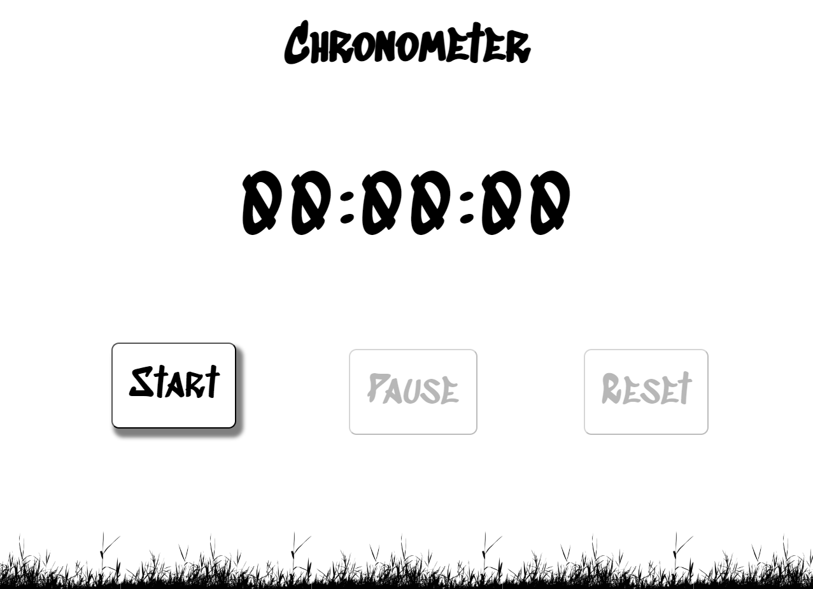

<h1 align="center">
    </img>  
    Chronometer | Cronômetro

 
 

</h1>

## Summary
 

* [Built with](#built-with) | Construído com
* [Description](#description) | Descrição
* [Funcionalities](#funcionalities) | Funcionalidades
* [Access the project](#access-the-project) | Acesse o projeto
* [Run the project](#run-the-project) | Execute o projeto
* [Developers](#developers) | Desenvolvedores
* [License](#license) | Licença

 

---

 

## Built with

 

 

(<a href="#summary">back to top | voltar ao topo</a>)

---

 

## Description
 

  EN-US

  The chronometer can be started, paused and reseted. The buttons have some characteristics that makes the experience more real (with transform, shadows and transitions) and that helps the usability of the user. When clicked, the buttons are disabled or enabled so the user can't be mistaken. When mouse hover the enabled buttons, there's an animation so the user knows it's functional. The background image moves when the cronometer is counting and stops when it isn't, warning the user.

 

  BR-PT

  O cronômetro pode ser iniciado, pausado e reiniciado. Os botões possuem algumas características que tornam a experiência mais real (com transformações, sombras e transições) e que ajudam na usabilidade do usuário. Quando clicados, os botões são desabilitados ou habilitados para que o usuário não se confunda. Quando o mouse passa sobre os botões habilitados, há uma animação para que o usuário saiba que está funcionando. A imagem de fundo se move quando o cronômetro está contando e para quando não está, alertando o usuário.

(<a href="#summary">back to top | voltar ao topo</a>)

---

 

## Funcionalities

 

  EN-US

✔️ By clicking the button "Start", the chronometer will start counting the seconds, minutes and hours from zero. 
✔️ By clicking the button "Pause", the chronometer will pause the counting. 
✔️ By clicking the button "Reset", the chronometer will be reseted. 
 

  BR-PT

✔️ Ao clicar no botão "Iniciar", o cronômetro começará a contar os segundos, minutos e horas a partir do zero. 
✔️ Ao clicar no botão "Pausar", o cronômetro pausará a contagem. 
✔️ Ao clicar no botão "Reiniciar", o cronômetro será resetado. 

(<a href="#summary">back to top | voltar ao topo</a>)

---

 

## Access the project

 

* Github link: https://github.com/lfogawa/Chronometer

(<a href="#summary">back to top | voltar ao topo</a>)

---

 

## Run the project

 

* CodePen link: https://codepen.io/lfogawa/full/QWqBNpG

(<a href="#summary">back to top | voltar ao topo</a>)

---

 

## Developers

 

|  Luís Felipe Ogawa|
| :---: |

Github: https://github.com/lfogawa  
LinkedIn: https://www.linkedin.com/in/lu%C3%ADs-felipe-ogawa/  

(<a href="#summary">back to top | voltar ao topo</a>)

---

 

## License

 

The [MIT License]() (MIT).

Copyright ©️ 2023 - Chronometer

(<a href="#summary">back to top | voltar ao topo</a>)
